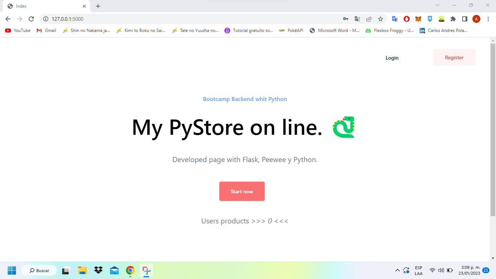
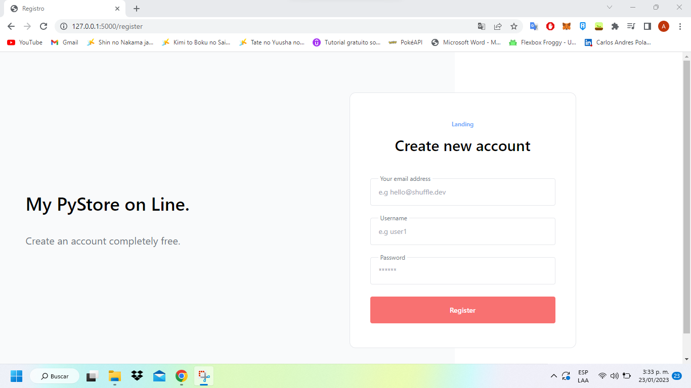
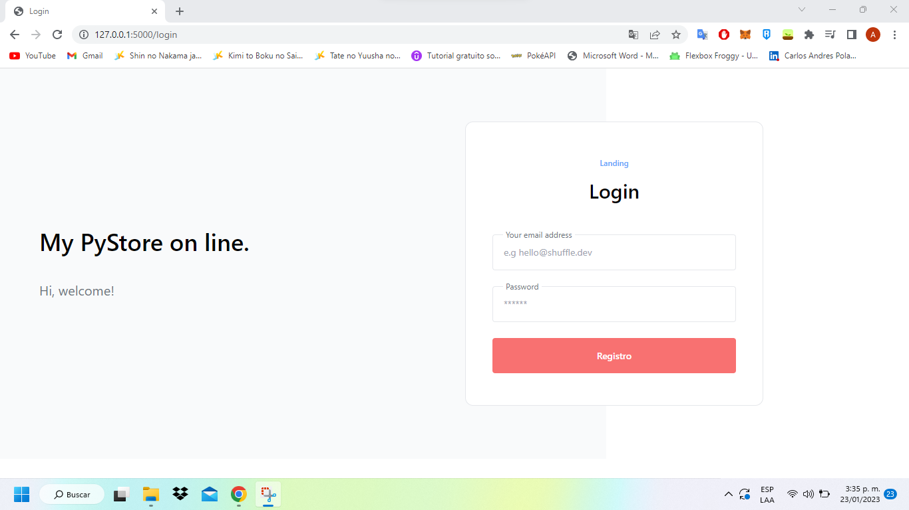
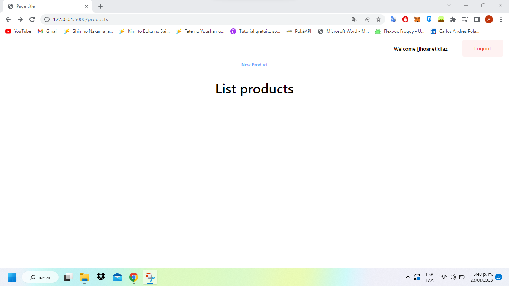
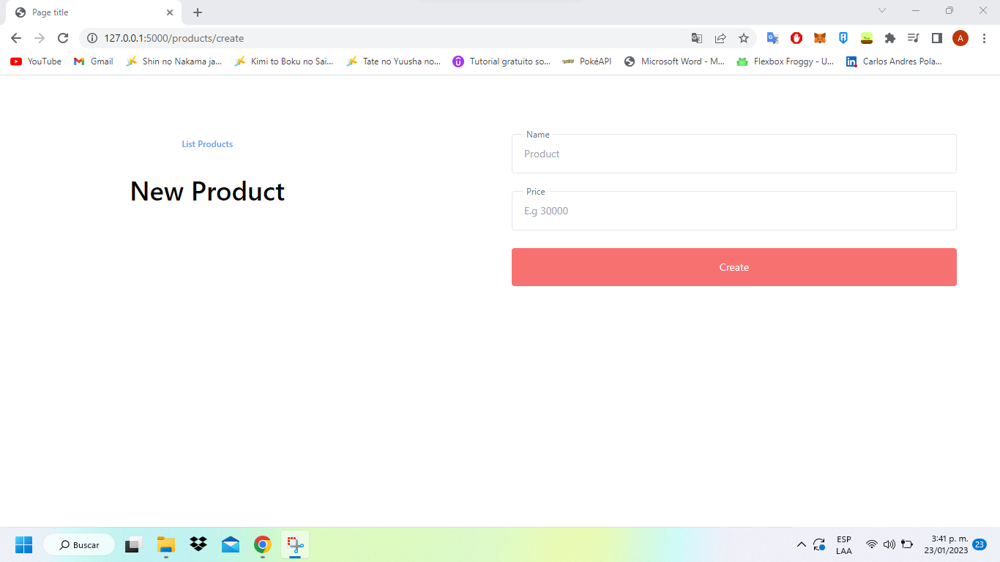

### Tienda online python

La pystore es una tienda en linea desarrollada con flask  cuenta con 8 rutas diferentes.
para correr el proyecto se deben instalar las dependecias. estan almacenadas en el archivo requirements.txt

cuneta con una base de datos la cual relaciona objetos con usuarios y los pinta en la pantalla.

## index

En la pagina principal podemos ver 3 botonoes uno de ellos nos lleva directo al login, otro a register y el que esta en el centro a register tambien.

En la pagina principal podemos ver 3 botonoes uno de ellos nos lleva directo al login, otro a register y el que esta en el centro a register tambien.

### register 

esta es la pagina de registro, cuenta de 3 campos username, email, password, ningun username ni email se puede repetir.

### login

cuenta de dos campos email y password.

## products

se almacenan todos los prodcutos, cuando el usuario no tiene productos creados esta en blanco cuando crea productos se ven 2 opciones, delete y upgrade.

## new product

crea nuevos productos cuenta con 2 campos nombre y precio 

